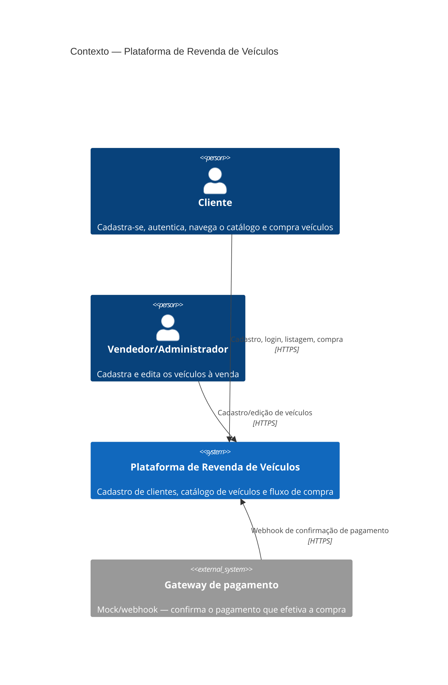
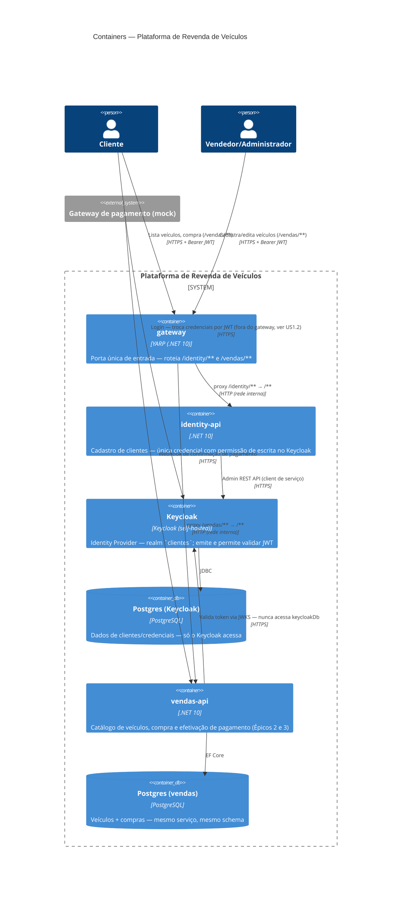
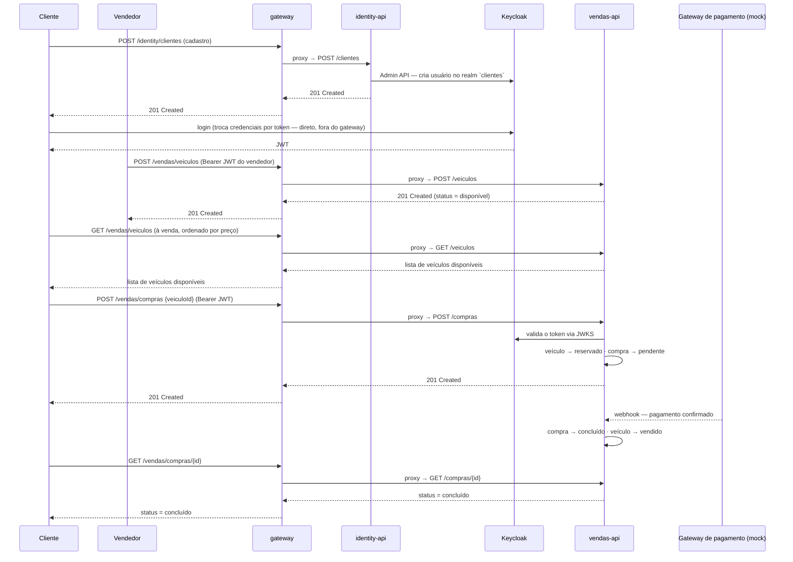

# Arquitetura — Plataforma de Revenda de Veículos

Plataforma para uma revendedora de veículos automotores vender online, construída para o
Trabalho Substitutivo de Tech Challenge (Fase 3, curso SOAT — PósTech/FIAP). Este documento
descreve a arquitetura **planejada**, antes da implementação em si.

> `BACKLOG.md` e `docs/refinamentos/` (histórias, critérios de aceite, o que já foi
> executado em código) ficam **fora deste repositório** — são material de planejamento da
> atividade acadêmica, não parte da entrega. Vivem no diretório da atividade
> (`fase3/BACKLOG.md` e `fase3/docs/refinamentos/`), um nível acima deste repositório —
> por isso não há link direto aqui: uma vez que este repositório for publicado sozinho
> (ex.: no GitHub), esses arquivos não o acompanham.

## Índice

- [C4 — Nível 1: Contexto](#c4--nível-1-contexto)
- [C4 — Nível 2: Containers](#c4--nível-2-containers)
- [Fluxo ponta-a-ponta (demonstração)](#fluxo-ponta-a-ponta-demonstração)
- [Database per Service](#database-per-service)
- [Decisões de arquitetura (ADRs)](#decisões-de-arquitetura-adrs)

---

## C4 — Nível 1: Contexto



## C4 — Nível 2: Containers



**Notas sobre o diagrama:**
- `gateway` (YARP) é a **porta única de entrada** para `identity-api` e `vendas-api` — o
  cliente nunca fala direto com eles (mesmo padrão do gateway usado no hackathon de
  arquitetura de software desta pós-graduação). O **login continua fora do gateway**: o
  cliente troca credenciais por token direto no Keycloak (ver US1.2 em
  `fase3/docs/refinamentos/US1.2-login.md`, fora deste repositório, e
  [ADR-0005](adr/0005-api-gateway-yarp.md)).
- `vendas-api` valida o JWT localmente via **JWKS** do Keycloak (chave pública) — nunca chama
  o `identity-api` nem acessa `keycloakDb` para isso. É o que garante o isolamento do serviço
  de identidade exigido pelo enunciado mesmo em tempo de execução, não só no deploy
  (ver [ADR-0002](adr/0002-dois-servicos-identity-vendas.md) e US1.3 em
  `fase3/docs/refinamentos/US1.1-cadastro-cliente.md`, fora deste repositório).
- `identity-api` é a **única** peça com credencial (client de serviço confidencial) para
  escrever no Keycloak via Admin REST API — o frontend nunca fala direto com a Admin API.
- Veículos e compras (Épicos 2 e 3) ficam no mesmo serviço/banco por decisão explícita — o
  PDF não exige separá-los entre si, só separar a identidade do resto (ver
  [ADR-0002](adr/0002-dois-servicos-identity-vendas.md)).

---

## Fluxo ponta-a-ponta (demonstração)

Corresponde ao teste início-a-fim exigido no vídeo de demonstração (US4.6): cadastro de
cliente, cadastro de veículo, compra e efetivação da compra.



---

## Database per Service

```
clientes (via Keycloak)  → identity-api   (credenciais e dados pessoais do cliente)
vendas                    → vendas-api     (veículos + compras — write model único, mesmo serviço)
```

Dois bancos lógicos isolados — nenhum serviço acessa o banco do outro. `vendas-api` mantém
veículos e compras no **mesmo** schema/transação porque pertencem ao mesmo serviço (decisão
de [ADR-0002](adr/0002-dois-servicos-identity-vendas.md)): isso também simplifica a regra de
concorrência da US3.2 (reservar um veículo e criar o pedido cabem numa única transação local,
sem precisar de transação distribuída entre serviços).

---

## Decisões de arquitetura (ADRs)

Formato [MADR](https://adr.github.io/madr/) em [`docs/adr/`](adr/):

- [ADR-0001 — Keycloak como provedor de identidade](adr/0001-keycloak-como-provedor-de-identidade.md)
- [ADR-0002 — Dois serviços (identity-api + vendas-api), não três](adr/0002-dois-servicos-identity-vendas.md)
- [ADR-0003 — .NET 10 como stack](adr/0003-dotnet-10.md)
- [ADR-0004 — Scalar em vez de Swagger/Swashbuckle](adr/0004-scalar-em-vez-de-swagger.md)
- [ADR-0005 — API Gateway (YARP) como porta única de entrada](adr/0005-api-gateway-yarp.md)
