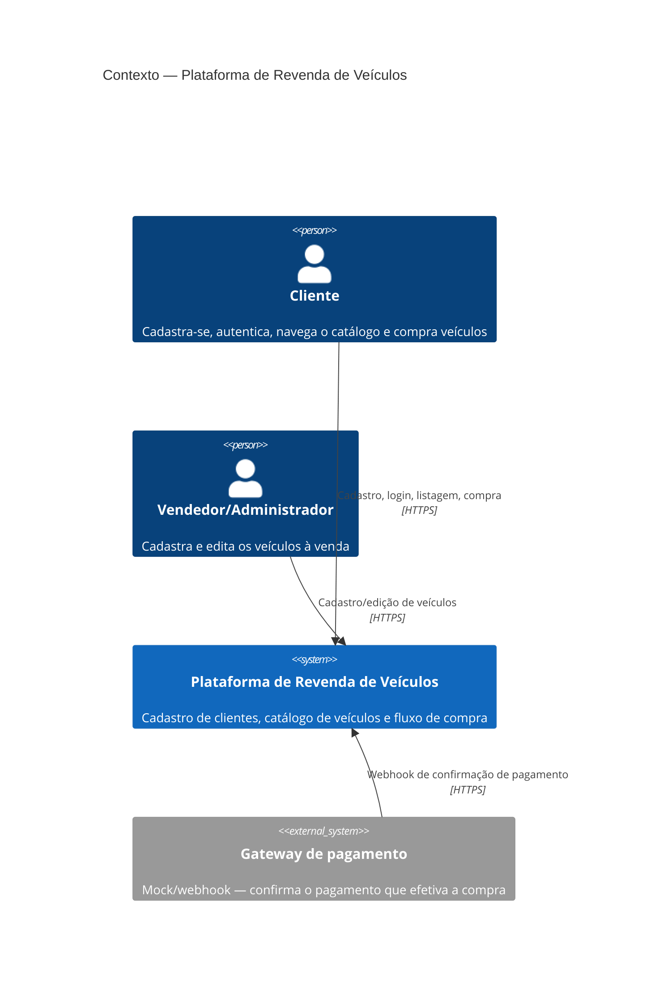
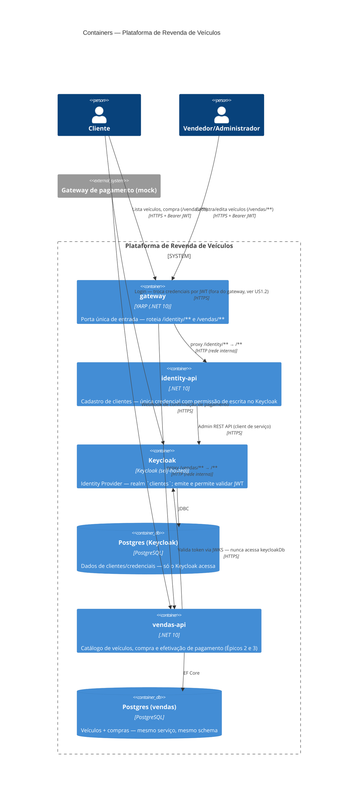
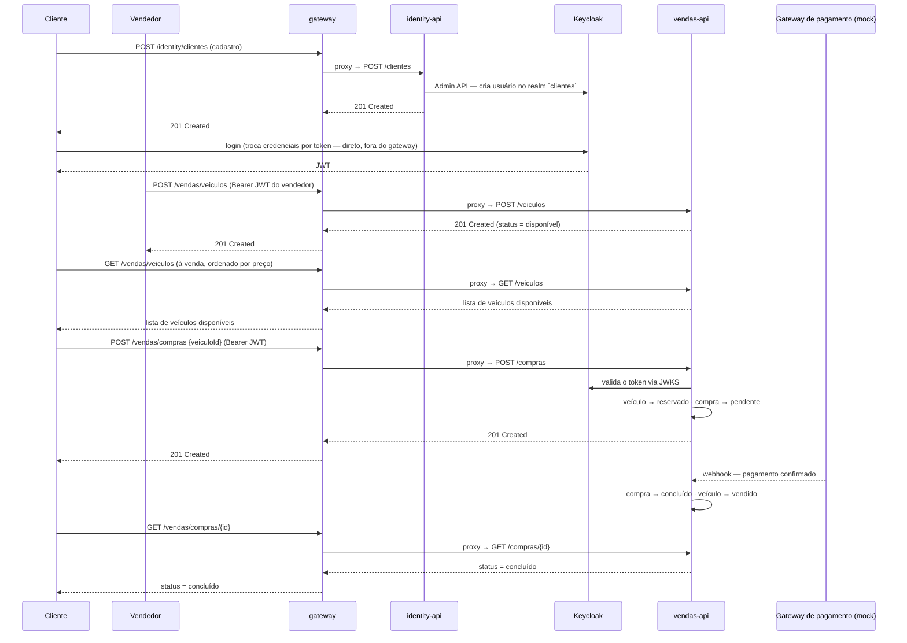
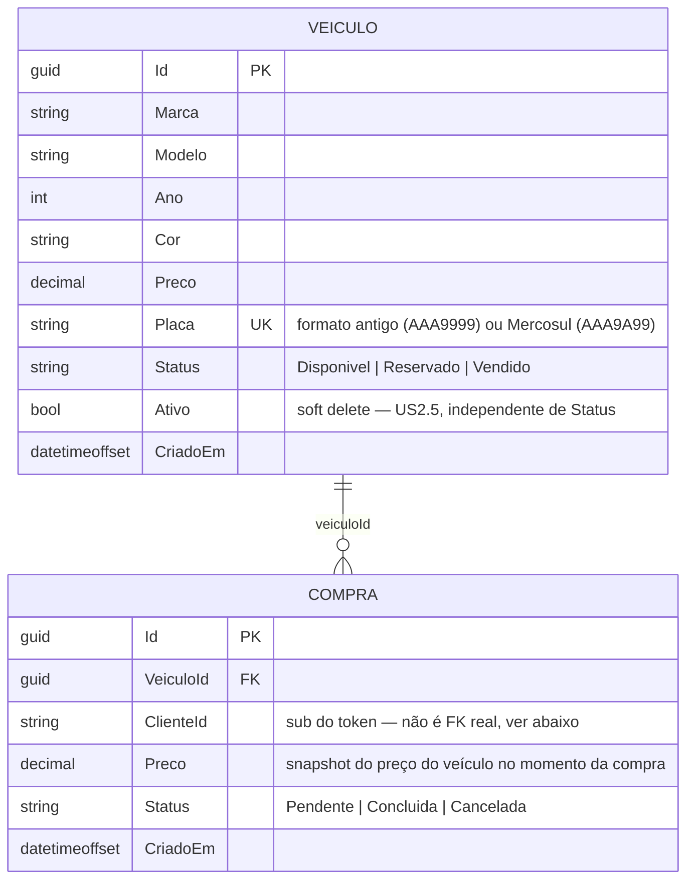

# Arquitetura — Plataforma de Revenda de Veículos

Plataforma para uma revendedora de veículos automotores vender online, construída para o
Trabalho Substitutivo de Tech Challenge (Fase 3, curso SOAT — PósTech/FIAP). Este documento
descreve a arquitetura **implementada** — os Épicos 1 a 3 (identidade, veículos, compras)
estão completos; onde algo ainda é planejado, não implementado, o texto diz isso
explicitamente.

> O backlog e o detalhamento de cada história (critérios de aceite, cenários de teste) são
> material de planejamento da atividade acadêmica e **não fazem parte deste repositório** —
> quem avalia este repositório não tem acesso a eles. Este documento e os ADRs em `docs/adr/`
> são a fonte de verdade autocontida sobre a arquitetura.

## Índice

- [C4 — Nível 1: Contexto](#c4--nível-1-contexto)
- [C4 — Nível 2: Containers](#c4--nível-2-containers)
- [Fluxo ponta-a-ponta (demonstração)](#fluxo-ponta-a-ponta-demonstração)
- [Modelagem de dados](#modelagem-de-dados)
- [Deploy](#deploy)
- [Decisões de arquitetura (ADRs)](#decisões-de-arquitetura-adrs)

---

## C4 — Nível 1: Contexto


```mermaid
C4Context
    title Contexto — Plataforma de Revenda de Veículos

    Person(cliente, "Cliente", "Cadastra-se, autentica, navega o catálogo e compra veículos")
    Person(vendedor, "Vendedor/Administrador", "Cadastra e edita os veículos à venda")
    System(plataforma, "Plataforma de Revenda de Veículos", "Cadastro de clientes, catálogo de veículos e fluxo de compra")
    System_Ext(pagamento, "Gateway de pagamento", "Mock/webhook — confirma o pagamento que efetiva a compra")

    Rel(cliente, plataforma, "Cadastro, login, listagem, compra", "HTTPS")
    Rel(vendedor, plataforma, "Cadastro/edição de veículos", "HTTPS")
    Rel(pagamento, plataforma, "Webhook de confirmação de pagamento", "HTTPS")
```

## C4 — Nível 2: Containers


```mermaid
C4Container
    title Containers — Plataforma de Revenda de Veículos

    Person(cliente, "Cliente")
    Person(vendedor, "Vendedor/Administrador")

    System_Boundary(plataforma, "Plataforma de Revenda de Veículos") {
        Container(gateway, "gateway", "YARP (.NET 10)", "Porta única de entrada — roteia /identity/** e /vendas/**")

        Container(identityApi, "identity-api", ".NET 10", "Cadastro de clientes — única credencial com permissão de escrita no Keycloak")
        Container(keycloak, "Keycloak", "Keycloak (self-hosted)", "Identity Provider — realm `clientes`; emite e permite validar JWT")
        ContainerDb(keycloakDb, "Postgres (Keycloak)", "PostgreSQL", "Dados de clientes/credenciais — só o Keycloak acessa")

        Container(vendasApi, "vendas-api", ".NET 10", "Catálogo de veículos, compra e efetivação de pagamento (Épicos 2 e 3)")
        ContainerDb(vendasDb, "Postgres (vendas)", "PostgreSQL", "Veículos + compras — mesmo serviço, mesmo schema")
    }

    System_Ext(pagamento, "Gateway de pagamento (mock)")

    Rel(cliente, gateway, "POST /identity/clientes (cadastro)", "HTTPS")
    Rel(cliente, keycloak, "Login — troca credenciais por JWT (fora do gateway, ver US1.2)", "HTTPS")
    Rel(cliente, gateway, "Lista veículos, compra (/vendas/**)", "HTTPS + Bearer JWT")
    Rel(vendedor, gateway, "Cadastra/edita veículos (/vendas/**)", "HTTPS + Bearer JWT")

    Rel(gateway, identityApi, "proxy /identity/** → /**", "HTTP (rede interna)")
    Rel(gateway, vendasApi, "proxy /vendas/** → /**", "HTTP (rede interna)")

    Rel(identityApi, keycloak, "Admin REST API (client de serviço)", "HTTPS")
    Rel(keycloak, keycloakDb, "JDBC")
    Rel(vendasApi, keycloak, "Valida token via JWKS — nunca acessa keycloakDb", "HTTPS")
    Rel(vendasApi, vendasDb, "EF Core")
    Rel(pagamento, vendasApi, "Webhook de confirmação de pagamento", "HTTPS")
```

**Notas sobre o diagrama:**
- `gateway` (YARP) é a **porta única de entrada** para `identity-api` e `vendas-api` — o
  cliente nunca fala direto com eles (mesmo padrão do gateway usado no hackathon de
  arquitetura de software desta pós-graduação). O **login continua fora do gateway**: o
  cliente troca credenciais por token direto no Keycloak, via ROPC (Resource Owner Password
  Credentials) num client público — ver [ADR-0005](adr/0005-api-gateway-yarp.md).
- `vendas-api` valida o JWT localmente via **JWKS** do Keycloak (chave pública) — nunca chama
  o `identity-api` nem acessa `keycloakDb` para isso. É o que garante o isolamento do serviço
  de identidade exigido pelo enunciado mesmo em tempo de execução, não só no deploy (ver
  [ADR-0002](adr/0002-dois-servicos-identity-vendas.md)).
- `identity-api` é a **única** peça com credencial (client de serviço confidencial) para
  escrever no Keycloak via Admin REST API — o frontend nunca fala direto com a Admin API.
- Veículos e compras (Épicos 2 e 3) ficam no mesmo serviço/banco por decisão explícita — o
  PDF não exige separá-los entre si, só separar a identidade do resto (ver
  [ADR-0002](adr/0002-dois-servicos-identity-vendas.md)).

---

## Fluxo ponta-a-ponta (demonstração)

Corresponde ao teste início-a-fim exigido no vídeo de demonstração (US4.6): cadastro de
cliente, cadastro de veículo, compra e efetivação da compra.


```mermaid
sequenceDiagram
    participant C as Cliente
    participant V as Vendedor
    participant GW as gateway
    participant IA as identity-api
    participant KC as Keycloak
    participant VA as vendas-api
    participant PG as Gateway de pagamento (mock)

    C->>GW: POST /identity/clientes (cadastro)
    GW->>IA: proxy → POST /clientes
    IA->>KC: Admin API — cria usuário no realm `clientes`
    IA-->>GW: 201 Created
    GW-->>C: 201 Created

    C->>KC: login (troca credenciais por token — direto, fora do gateway)
    KC-->>C: JWT

    V->>GW: POST /vendas/veiculos (Bearer JWT do vendedor)
    GW->>VA: proxy → POST /veiculos
    VA-->>GW: 201 Created (status = disponível)
    GW-->>V: 201 Created

    C->>GW: GET /vendas/veiculos (à venda, ordenado por preço)
    GW->>VA: proxy → GET /veiculos
    VA-->>GW: lista de veículos disponíveis
    GW-->>C: lista de veículos disponíveis

    C->>GW: POST /vendas/compras {veiculoId} (Bearer JWT)
    GW->>VA: proxy → POST /compras
    VA->>KC: valida o token via JWKS
    VA->>VA: veículo → reservado · compra → pendente
    VA-->>GW: 201 Created
    GW-->>C: 201 Created

    PG-->>VA: webhook — pagamento confirmado
    VA->>VA: compra → concluído · veículo → vendido

    C->>GW: GET /vendas/compras/{id}
    GW->>VA: proxy → GET /compras/{id}
    VA-->>GW: status = concluído
    GW-->>C: status = concluído
```

---

## Modelagem de dados

```
clientes (via Keycloak)  → identity-api   (credenciais e dados pessoais do cliente)
vendas                    → vendas-api     (veículos + compras — write model único, mesmo serviço)
```

Dois bancos lógicos isolados — nenhum serviço acessa o banco do outro. `vendas-api` mantém
veículos e compras no **mesmo** schema/transação porque pertencem ao mesmo serviço (decisão
de [ADR-0002](adr/0002-dois-servicos-identity-vendas.md)): isso também simplifica a regra de
concorrência da US3.2 (reservar um veículo e criar a compra cabem numa única transação local,
sem precisar de transação distribuída entre serviços).

### `vendas-api` (Postgres) — nível de campo


```mermaid
erDiagram
    VEICULO ||--o{ COMPRA : "veiculoId"
    VEICULO {
        guid Id PK
        string Marca
        string Modelo
        int Ano
        string Cor
        decimal Preco
        string Placa UK "formato antigo (AAA9999) ou Mercosul (AAA9A99)"
        string Status "Disponivel | Reservado | Vendido"
        bool Ativo "soft delete — US2.5, independente de Status"
        datetimeoffset CriadoEm
    }
    COMPRA {
        guid Id PK
        guid VeiculoId FK
        string ClienteId "sub do token — não é FK real, ver abaixo"
        decimal Preco "snapshot do preço do veículo no momento da compra"
        string Status "Pendente | Concluida | Cancelada"
        datetimeoffset CriadoEm
    }
```

Um veículo pode ter mais de uma `Compra` ao longo do tempo (`||--o{`, não `||--o|`) — ex.: uma
`Cancelada` pela expiração automática (US3.5) seguida de uma nova compra bem-sucedida pra o
mesmo veículo, depois dele voltar a `Disponivel`.

**`Compra.ClienteId` não é uma foreign key de verdade — é aqui que a separação entre
identidade e vendas aparece no nível de dado, não só de container.** `vendas-api` não tem, e
nunca teve, uma tabela `Cliente` própria: `ClienteId` é uma `string` opaca que só *coincide*,
por convenção, com o `sub` (claim do JWT) que o Keycloak emite — não há constraint de
integridade referencial no Postgres ligando as duas coisas, porque não há nada do lado de
`vendas-api` pra referenciar. Confirmar que um `ClienteId` corresponde a um cliente de verdade
é responsabilidade do Keycloak (validação de token, [ADR-0001](adr/0001-keycloak-como-provedor-de-identidade.md)),
não do schema deste serviço.

### Cliente (`identity-api`) — mapeamento pro Keycloak, não uma tabela

`identity-api` não tem banco próprio — todo dado de cliente vira campo nativo ou *attribute*
customizado de um usuário do Keycloak (confirmado lendo `KeycloakClienteProvider.cs`, não
presumido):

| Campo do cadastro | Onde vai no Keycloak | Nativo ou customizado |
|---|---|---|
| `Nome` | `firstName` | Nativo (sem `lastName` — não usado) |
| `Email` | `username` **e** `email` | Nativo |
| `Senha` | `credentials[0]` (`type: password`, `temporary: false`) | Nativo |
| `Cpf` | `attributes["cpf"]` | Customizado (Keycloak não tem CPF nativo) |
| `Telefone` (opcional) | `attributes["telefone"]` | Customizado |

Sem campo `endereco` — não existe no comando real (`CriarClienteCommand`); só é exigido mais
adiante, no momento da compra (US3.1). `attributes` é um dicionário livre por realm que o
Keycloak permite estender — é o mecanismo, não uma tabela paralela mantida por este projeto.

---

## Deploy

Alvo local: **cluster Kubernetes via `kind`, provisionado por Terraform**
(`infra/terraform/`) — não nuvem paga, não Docker Compose sozinho (não é IaC: nada ali
provisiona infraestrutura, só orquestra containers já existentes na máquina). Terraform cuida
só do que precisa existir *antes* de qualquer container da aplicação — o cluster em si e um
registry Docker local; o que roda dentro do cluster é YAML puro (`infra/k8s/`), aplicado via
`kubectl`, não recursos Terraform de Kubernetes (evita o problema conhecido de configurar esse
provider a partir de um kubeconfig que só existe depois do cluster já criado).

Os 7 serviços do `docker-compose.yml` (gateway, identity-api, vendas-api, Keycloak, Keycloak
DB, vendas DB, Mailpit) viram 7 pares `Deployment`+`Service` no cluster, um namespace dedicado
(`revendax`), `PersistentVolumeClaim` pros dois Postgres e as mesmas portas expostas de sempre
(`8080` gateway, `8081` Keycloak, `8025` Mailpit) via `extraPortMappings` do próprio `kind` —
sem Ingress controller, um único node não justifica essa camada a mais. `docker-compose.yml`
continua existindo, sem mudança: é o caminho rápido pra desenvolvimento local; o cluster
`kind` é o alvo de "deploy automatizado" propriamente dito.

## Decisões de arquitetura (ADRs)

Formato [MADR](https://adr.github.io/madr/) em [`docs/adr/`](adr/):

- [ADR-0001 — Keycloak como provedor de identidade](adr/0001-keycloak-como-provedor-de-identidade.md)
- [ADR-0002 — Dois serviços (identity-api + vendas-api), não três](adr/0002-dois-servicos-identity-vendas.md)
- [ADR-0003 — .NET 10 como stack](adr/0003-dotnet-10.md)
- [ADR-0004 — Scalar em vez de Swagger/Swashbuckle](adr/0004-scalar-em-vez-de-swagger.md)
- [ADR-0005 — API Gateway (YARP) como porta única de entrada](adr/0005-api-gateway-yarp.md)
